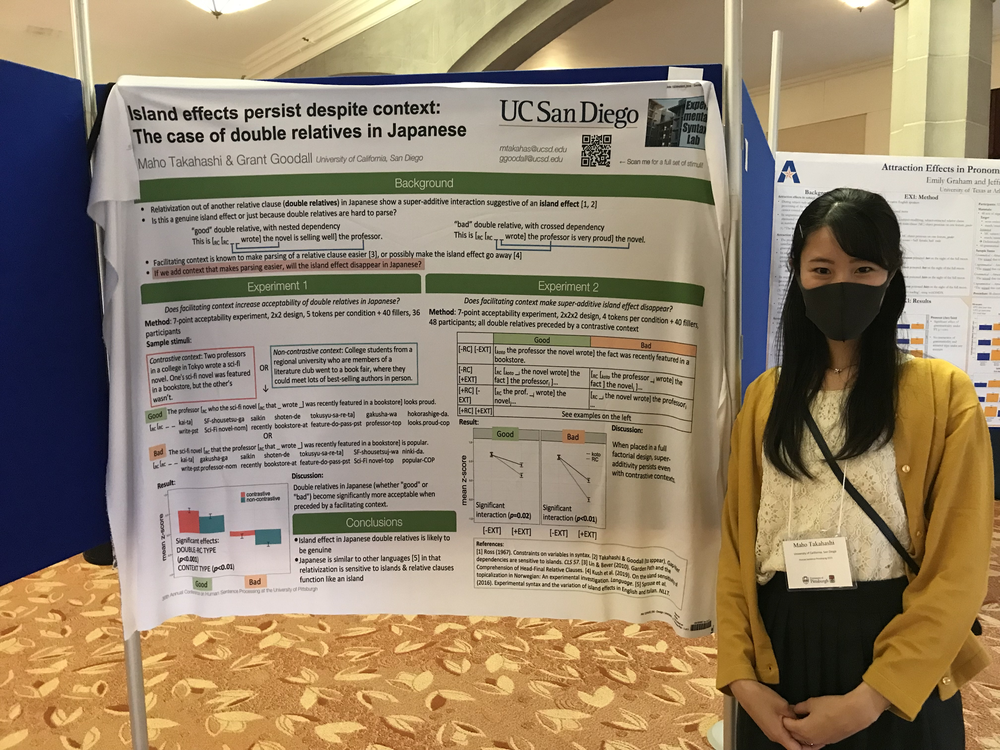

My name is Maho Takahashi, and I am a PhD candidate in Linguistics at the **University of California, San Diego**. 

I am a member of the [Experimental Syntax Lab](http://grammar.ucsd.edu/syntaxlab/) directed by Dr. Grant Goodall and the [Language and Development Lab](http://www.ladlab.com/) directed by Dr. David Barner.

My research interest lies in quantifying our intuition about grammatical and semantic knowledge through experimentation, and exploring the interaction of cognitive capacities and linguistic competence in language acquisition and making grammaticality judgments.

I am a former member of the [Language Development and Processing Lab](https://depts.washington.edu/ldplab/) founded by the late Akira Omaki at the **University of Washington**.

Previously I received a master's degree in Linguistics from the **University of Hawaiʻi at Mānoa**, and a bachelor's degree in International Liberal Studies from **Waseda University** (Tokyo, Japan).

Email: mtakahas\[at\]ucsd\[dot\]edu

[LinkedIn](https://www.linkedin.com/in/maho-takahashi/)/[GitHub](https://github.com/matakahas)/[Google Scholar](https://scholar.google.com/citations?view_op=list_works&hl=en&user=JHRkrfAAAAAJ)/[OSF.io](https://osf.io/6c4gb/)

[日本語](./nihongo.md)
