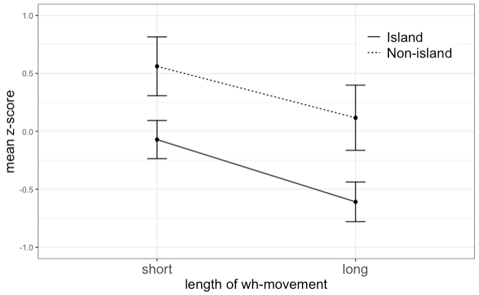

## How to plot the results of an acceptability judgment experiment with error bars 


```r
data <- read.csv('./sampledata.csv')
head(data, 3)
```

```
##   Movement Island_Type Island Distance Item
## 1       WH         whe    non       sh    1
## 2       WH         whe    non       sh    2
## 3       WH         whe    non       sh    3
##                                   Sentence Subj_id Score
## 1 Who thinks that Paul stole the necklace?       1     6
## 2     Who thinks that Matt chased the bus?       1     2
## 3 Who thinks that Tom sold the television?       1     3
```
I will first convert raw acceptability scores to z-scores.

```r
data <- data %>% group_by(Subj_id) %>% mutate(Z_score = (Score - mean(Score)) / sd(Score))
```

Next, I will create a summary table from which the plot is made. The summary consists of the mean and the standard deviation of raw acceptability scores and z-scores, as well as the standard error of the z-scores (calculated by the standard deviation divided by the square root of the number of participants). 

```r
summary_data = data %>% 
  group_by(Island, Distance) %>%
  summarize(mean = mean(Score), mean.z = mean(Z_score),
            sd = sd(Score), sd.z = sd(Z_score),
            se = sd(Score)/sqrt(16), se.z = sd(Z_score)/sqrt(16))
```

```
## `summarise()` has grouped output by 'Island'. You can override using the `.groups` argument.
```

```r
summary_data
```

```
## # A tibble: 4 × 8
## # Groups:   Island [2]
##   Island Distance  mean  mean.z    sd  sd.z    se  se.z
##   <chr>  <chr>    <dbl>   <dbl> <dbl> <dbl> <dbl> <dbl>
## 1 isl    lg        2.59 -0.608   1.18 0.684 0.295 0.171
## 2 isl    sh        3.53 -0.0708  1.13 0.658 0.282 0.164
## 3 non    lg        3.89  0.117   1.92 1.12  0.480 0.281
## 4 non    sh        4.59  0.561   1.71 1.02  0.427 0.254
```
Here is how I would draw a plot

```r
#rename and reorder the values under the Distance column
summary_data$Distance[summary_data$Distance == "sh"] <- "short"
summary_data$Distance[summary_data$Distance == "lg"] <- "long"

summary_data$Distance = factor(summary_data$Distance, levels = c("short", "long"))
```


```r
summary_data %>% ggplot(aes(x=Distance, y=mean.z))+
  geom_point()+
  geom_path(aes(group = Island, linetype = Island))+
  #guides(linetype = guide_legend(reverse = TRUE))+
  geom_errorbar(aes(ymin=mean.z-se.z, ymax=mean.z+se.z), width=0.1)+
  xlab('length of wh-movement')+
  ylab('mean z-score')+
  expand_limits(y = c(-1, 1))+
  theme_bw()+
  scale_linetype_discrete(labels = c('Island', 'Non-island'))+
  theme(legend.title = element_blank(),
        legend.position = c(0.85, 0.85),
        legend.text = element_text(size = 15),
        axis.text.x = element_text(size = 15),
        axis.title.x = element_text(size = 15),
        axis.title.y = element_text(size = 15))
```

<!-- -->

