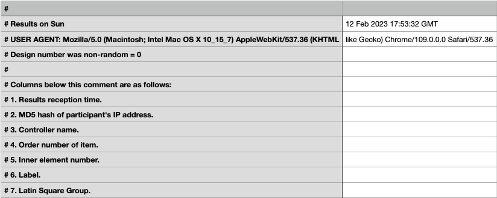

## How to assign column names to data output by PCIbex

**Acknowledgement**: I thank my RA Sidney Ma for coming up with the code.

[PennController for IBEX](https://doc.pcibex.net/) is a great tool for conducting various psycholinguistic experiments like sentence acceptability experiments, but one potential downside of the platform is that the data it outputs is not very clean. In particular, rawdata has no column values.



And while importing the dataset automatically assigns column names, those column names are far from descriptive.


```python
import pandas as pd
```


```python
sample = pd.read_csv('/your/path/results.csv', header=None)
sample.head(3)
```


<div>
<style scoped>
    .dataframe tbody tr th:only-of-type {
        vertical-align: middle;
    }

    .dataframe tbody tr th {
        vertical-align: top;
    }

    .dataframe thead th {
        text-align: right;
    }
</style>
<table border="1" class="dataframe">
  <thead>
    <tr style="text-align: right;">
      <th></th>
      <th>0</th>
      <th>1</th>
      <th>2</th>
      <th>3</th>
      <th>4</th>
      <th>5</th>
      <th>6</th>
      <th>7</th>
      <th>8</th>
      <th>9</th>
      <th>...</th>
      <th>16</th>
      <th>17</th>
      <th>18</th>
      <th>19</th>
      <th>20</th>
      <th>21</th>
      <th>22</th>
      <th>23</th>
      <th>24</th>
      <th>25</th>
    </tr>
  </thead>
  <tbody>
    <tr>
      <th>0</th>
      <td># Results on Sun</td>
      <td>12 Feb 2023 17:53:32 GMT</td>
      <td>NaN</td>
      <td>NaN</td>
      <td>NaN</td>
      <td>NaN</td>
      <td>NaN</td>
      <td>NaN</td>
      <td>NaN</td>
      <td>NaN</td>
      <td>...</td>
      <td>NaN</td>
      <td>NaN</td>
      <td>NaN</td>
      <td>NaN</td>
      <td>NaN</td>
      <td>NaN</td>
      <td>NaN</td>
      <td>NaN</td>
      <td>NaN</td>
      <td>NaN</td>
    </tr>
    <tr>
      <th>1</th>
      <td># USER AGENT: Mozilla/5.0 (Macintosh; Intel Ma...</td>
      <td>like Gecko) Chrome/109.0.0.0 Safari/537.36</td>
      <td>NaN</td>
      <td>NaN</td>
      <td>NaN</td>
      <td>NaN</td>
      <td>NaN</td>
      <td>NaN</td>
      <td>NaN</td>
      <td>NaN</td>
      <td>...</td>
      <td>NaN</td>
      <td>NaN</td>
      <td>NaN</td>
      <td>NaN</td>
      <td>NaN</td>
      <td>NaN</td>
      <td>NaN</td>
      <td>NaN</td>
      <td>NaN</td>
      <td>NaN</td>
    </tr>
    <tr>
      <th>2</th>
      <td># Design number was non-random = 0</td>
      <td>NaN</td>
      <td>NaN</td>
      <td>NaN</td>
      <td>NaN</td>
      <td>NaN</td>
      <td>NaN</td>
      <td>NaN</td>
      <td>NaN</td>
      <td>NaN</td>
      <td>...</td>
      <td>NaN</td>
      <td>NaN</td>
      <td>NaN</td>
      <td>NaN</td>
      <td>NaN</td>
      <td>NaN</td>
      <td>NaN</td>
      <td>NaN</td>
      <td>NaN</td>
      <td>NaN</td>
    </tr>
  </tbody>
</table>
<p>3 rows × 26 columns</p>
</div>


Here, I'd like to point out that the index column at the start of each entry could be used to find the corresponding columns. That way, we wouldn't need to manually figure out which column is which, nor would we need to rename them.

The strategy is to collect these index columns, and add the index columns back as the new headers.


```python
# The index columns all start with "#" and a number.
# Return true if a string fits the above description.
def is_index_col(s):
    if type(s) == str:
        if len(s) > 2:
            if "#" in s and s[2].isnumeric():
                return True
    return False

index_cols = list(sample[sample[0].apply(is_index_col)][0].unique())
index_cols
```


    ['# 1. Results reception time.',
     "# 2. MD5 hash of participant's IP address.",
     '# 3. Controller name.',
     '# 4. Order number of item.',
     '# 5. Inner element number.',
     '# 6. Label.',
     '# 7. Latin Square Group.',
     '# 8. PennElementType.',
     '# 9. PennElementName.',
     '# 10. Parameter.',
     '# 11. Value.',
     '# 12. EventTime.',
     '# 13. id.',
     '# 14. lang_comf.',
     '# 15. comf.',
     '# 16. lang.',
     '# 17. parents.',
     '# 18. age_US.',
     '# 19. birth.',
     '# 20. gender.',
     '# 21. age.',
     '# 22. Comments.',
     '# 22. LIST.',
     '# 23. ITEM.',
     '# 24. CONDITION.',
     '# 25. SENTENCE.',
     '# 26. Comments.']


```python
# For some reason, "Comments" and "LIST" are both labelled as #22. I'll remove "comments" manually.
index_cols.remove("# 22. Comments.")
```


```python
# Remove irrelevant rows
sample = sample[(sample[5] == "experiment-filler") | 
        (sample[5] == "experiment-critical") | 
        (sample[5] == "background")]
```


```python
# Replace columns
sample.columns = index_cols
sample.head(3)
```


<div>
<style scoped>
    .dataframe tbody tr th:only-of-type {
        vertical-align: middle;
    }

    .dataframe tbody tr th {
        vertical-align: top;
    }

    .dataframe thead th {
        text-align: right;
    }
</style>
<table border="1" class="dataframe">
  <thead>
    <tr style="text-align: right;">
      <th></th>
      <th># 1. Results reception time.</th>
      <th># 2. MD5 hash of participant's IP address.</th>
      <th># 3. Controller name.</th>
      <th># 4. Order number of item.</th>
      <th># 5. Inner element number.</th>
      <th># 6. Label.</th>
      <th># 7. Latin Square Group.</th>
      <th># 8. PennElementType.</th>
      <th># 9. PennElementName.</th>
      <th># 10. Parameter.</th>
      <th>...</th>
      <th># 17. parents.</th>
      <th># 18. age_US.</th>
      <th># 19. birth.</th>
      <th># 20. gender.</th>
      <th># 21. age.</th>
      <th># 22. LIST.</th>
      <th># 23. ITEM.</th>
      <th># 24. CONDITION.</th>
      <th># 25. SENTENCE.</th>
      <th># 26. Comments.</th>
    </tr>
  </thead>
  <tbody>
    <tr>
      <th>65</th>
      <td>1676224412</td>
      <td>eeba289e3ac0463f13af3ea14e757415</td>
      <td>PennController</td>
      <td>52.0</td>
      <td>0.0</td>
      <td>experiment-filler</td>
      <td>NaN</td>
      <td>PennController</td>
      <td>53</td>
      <td>_Trial_</td>
      <td>...</td>
      <td>undefined</td>
      <td>undefined</td>
      <td>undefined</td>
      <td>undefined</td>
      <td>undefined</td>
      <td>1</td>
      <td>9.0</td>
      <td>intermediate</td>
      <td>Which teachers are the administrator firing at...</td>
      <td>NaN</td>
    </tr>
    <tr>
      <th>66</th>
      <td>1676224412</td>
      <td>eeba289e3ac0463f13af3ea14e757415</td>
      <td>PennController</td>
      <td>52.0</td>
      <td>0.0</td>
      <td>experiment-filler</td>
      <td>NaN</td>
      <td>PennController</td>
      <td>53</td>
      <td>_Header_</td>
      <td>...</td>
      <td>undefined</td>
      <td>undefined</td>
      <td>undefined</td>
      <td>undefined</td>
      <td>undefined</td>
      <td>1</td>
      <td>9.0</td>
      <td>intermediate</td>
      <td>Which teachers are the administrator firing at...</td>
      <td>NaN</td>
    </tr>
    <tr>
      <th>67</th>
      <td>1676224412</td>
      <td>eeba289e3ac0463f13af3ea14e757415</td>
      <td>PennController</td>
      <td>52.0</td>
      <td>0.0</td>
      <td>experiment-filler</td>
      <td>NaN</td>
      <td>PennController</td>
      <td>53</td>
      <td>_Header_</td>
      <td>...</td>
      <td>undefined</td>
      <td>undefined</td>
      <td>undefined</td>
      <td>undefined</td>
      <td>undefined</td>
      <td>1</td>
      <td>9.0</td>
      <td>intermediate</td>
      <td>Which teachers are the administrator firing at...</td>
      <td>NaN</td>
    </tr>
  </tbody>
</table>
<p>3 rows × 26 columns</p>
</div>


Now we won't have to figure out which column stands for list number, acceptability judgment, etc. Of course, feel free to rename the columns if you think that the default names are unwieldy (like the second column, which is a unique identifier of participants).
