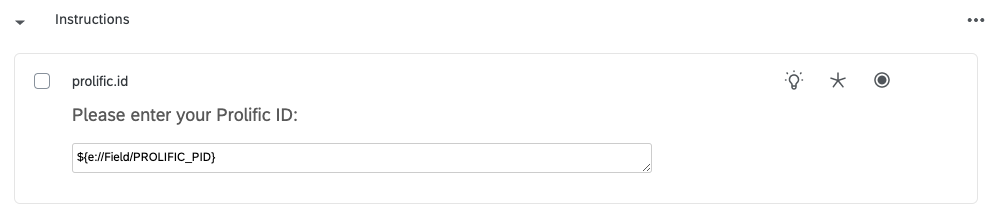
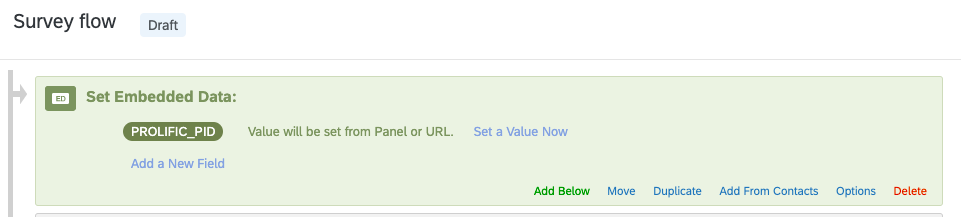
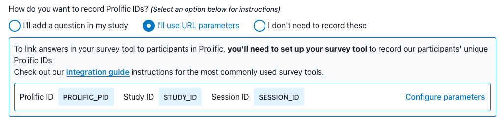

### How to get Qualtrics to autofill Prolific participant ID

#### On Qualtrics
1. On the "Builder" view, put this code `${e://Field/PROLIFIC_PID}` in a field where you ask participants to input their ID.

2. On the "Survey flow" view, add an "Enbedded Data" block at the top of the survey and add a value `PROLIFIC_PID`

#### On Prolific
1. Under the "STUDY LINK" section, choose the option "I'll use URL parameters" to the question "How do you want to record Prolific IDs?" Make sure that there is now a parameter `PROLIFIC_PID`.

