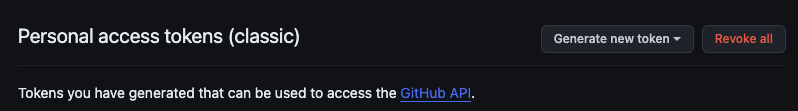

## How to solve n00b errors on Github
It's a good practice to store scripts and data on an online repository like OSF, Github/Bitbucket, or Google Drive. Among these options, you might want to use Github for its ability to version control. Here are some of the errors I keep making because I'm still new to Github and how to solve them.

### Authentication error
After making edits in your local folder, you'll want to commit those edits and push them to a remote repository. But the command may fail with a message like this:

> fatal: Authentication Failed

When this happens, you should generate a **personal access token** to complete authentication. You can make one by going to Settings (not your repository settings, your account settings) and select "Developer setting" from the bottom of the left side menu.

Then, choose "Personal access tokens" and "Tokens (classic)". 

Click on "Generate new token" and choose "Generate new token (classic)". You'll have to enter your Github password.

You will have to fill out the following information: Note, Expiration, and Scopes. For pushing changes to repositories, make sure to check "repo" under the Scopes section. Then click "Generate token" button.

You should then see your personal access token. Make sure to write it down as it won't be displayed again once you exit the tab.

With the personal access token, try pushing to a remote repository again. You should now be prompted to input your Github account and password. Enter the token for password and hit Enter. Now you should be able to complete the push to the remote repository.

You can push to any other repositories without the authentication error while the personal access token is valid. 

### Divergent branches
If there have been some changes made in the remote repository, you'll want to reflect them in your local folder with the `git pull` command. The command can, however, fail with a message like this:

> hint: You have divergent branches and need to specify how to reconcile them.

This happens when when both remote and local repositories have new commits since they last shared a common commit. It's common when multiple people are working on a project, but it can happen when there's only one person working on the project as well. In this case, we need to resolve the conflicts manually.

1. Run `git fetch` to retrieve changes made to the remote repo without applying them to your local repo (that's what `git pull` does)
2. Run `git merge` to merge local and remote branches. If there are conflicts, Git will pause the merge process and ask you to resolve conflicts manually.
3. Use a text editor to open the conflicted files. Git will mark the conflicting sections in the file, like in the screenshot below.

4. Edit the file to resolve conflicts between the conflicting branches. Remove the conflict markers once you've resolved the issues.
5. Run `git merge --continue` to finish the merge.

### Connecting local and remote repositories
If you have created a remote repository and now want to connect it with one of your local repositories, you should `cd` to your local repository on Terminal, and input the following code:

`git init`

`git remote add origin https://github.com/username/repository.git` (change `username` and `repository`. Don't forget `.git` in the end!)

`git branch -M main`

`git push -u origin main`

Also when you create a remote repo with an intention of linking it with a local repo, don't check the "Add a README file" option since that will cause a conflict when trying to push the content of local repo to remote repo (as local repo doesn't have the README).
