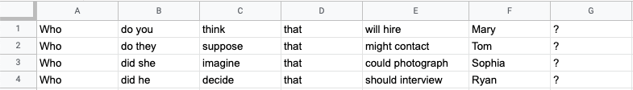
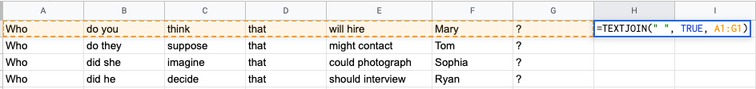
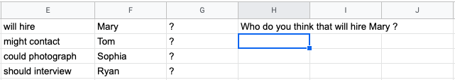

### How to concatenate text cells without losing data and with a space
When creating stimuli for an acceptability judgment experiment, it is a good practice to segment each sentence into multiple cells to ensure that stimuli under the same condition differ only in lexical items.

When it's time to concatenate the texts into one string, the `TEXTJOIN` function does the trick. Note that the order of arguments is (i) separator, (ii) ignore empty (set to TRUE), and (iii) cells to concatenate.

A new cell with a concatenated string is shown below.

