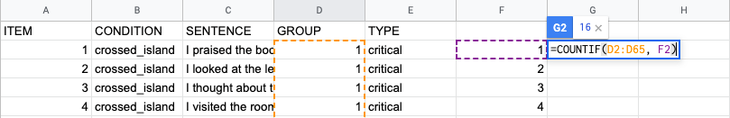
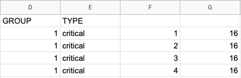

### How to check counterbalancing on Excel
In making stimuli for an acceptability judgment experiment, it's a standard practice to make counterbalanced lists of experimental stimuli using a Latin square design. In order to make sure that counterbalancing is done correctly, I often use the `COUNTIF` function.

I made a list of values under the GROUP (=list) column, and entered the function next to each value.

After applying the function to all four values, I can see that each list has exactly 16 items, suggesting that counterbalancing was successful.

