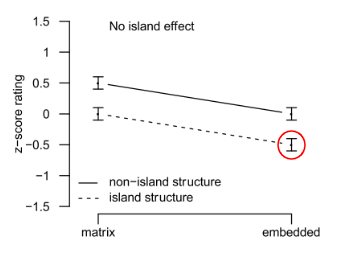
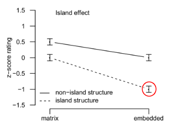

## 実験的手法を用いた統語論（Experimental syntax）とは？
* 統語論（syntax）において、特定の言語でどういった文構造が可能か（＝文法）の証明として例文とそれらに対する評価が用いられることが一般的である。英語での例を挙げると、
  * 主張：英語の文では主語も疑問詞の場合、目的語の疑問詞を文頭に動かすことができない（”Superiority Effect”）

|   |   |   |   |
|---|---|---|---|
| (1) | a. | What did  you  buy __? |                                | 
|     | b. | \* What did  who  buy __? | （アスタリスク＝非文法的な文） |   
|     | c. | Who bought what?           |                                |   

* (1)のような文はその言語を話す著者自身によって作られ評価されることが多く、特に話者の少ない言語などではそういった評価は有効かつ貴重なデータである。
* しかし、近年になって個人によって行われる文評価に代わり、複数の被験者を募って文に対する許容度（acceptability）を数量化する試みが行われて来ている。そういった文の許容度を測る実験（acceptability experiment）にはいくつかのメリットがある。
* そのうちの一つに、**文の許容度に影響を与えているものをより詳しく解明することが出来る**という点がある。Experimental syntaxにおいて最も研究されている現象に島の制約（island constraints）がある。統語論におけるislandとは、その名の通り中から単語を動かすことが出来ない一連の構造をさす。英語では主に以下のような構造がislandとして挙げられている。

|   |   |   |   
|---|---|---|
| (2) | a. | Adjunct island |                                
|     |  | \* What did you laugh \[because Sam ate __ by accident\]? |   
|     | b. | Complex noun phrase island |
|     |  | \* What did you hear \[the rumor that Jodie discovered __\]? | 
|     | c. | Subject island |
|     |  | \* What did \[the story about __\] impress Mary? | 
|     | d. | “Whether” island |
|     |  | \* What did you wonder \[whether Lisa invented __\]? | 

* (2)の文の許容度の低さに議論の余地は無いが、上のような例のみに基づいて「英語にはisland constraintsが文法として存在する」と結論付けることは出来ない。なぜなら(2)の文には他に許容度を下げている以下の要因が存在するからである。
  1. (2)の文ではいずれもwhatとwhatがもともと存在した場所（__で表されている）に大きな間が空いているが、これが許容度を下げている可能性がある。
  2. またislandとされる構造はいずれも複雑なものであり、これらを頭の中で処理すること自体許容度の低下に繋がっているとも考えうる。
* そこでacceptability experimentを行うことにより、(i)と(ii)といった要因と切り離してisland constraintsを証明することが可能になるのである。例えば(2d)の“whether” islandを証明したい場合、(i)の要因を\[±long distance\]、(ii)の要因を\[±island structure\]とし、2×2=4つの条件の文章を用意する。

|   |   |   |   
|---|---|---|
| (3) | a. | \[-long distance\]\[-island structure\] |                                
|     |  | Who __ thinks \[that John bought a car\]? |   
|     | b. | \[+long distance\]\[-island structure\] |
|     |  | What do you think \[that John bought __ \]? | 
|     | c. | \[-long distance\]\[+island structure\] |
|     |  | Who __ wonders \[whether John bought a car\]? | 
|     | d. | \[+long distance\]\[+island structure\] |
|     |  | What do you wonder \[whether John bought __ \]? | 

* こういった異なる要因を個別にコントロールする手法はfactorial designと呼ばれ、acceptability experimentの最大の特徴である。そして(3)のような文を被験者（英語を第一言語とする者）に評価（最もポピュラーなのが7段階評価）をしてもらい、結果の可視化、統計的な分析などが行われる。
* Acceptability experimentのどのような結果が、「英語には“whether” island constraintが文法として存在する」という仮説の否定または証明に繋がるか見てゆこう。まず以下のような結果になった場合だが、◯で囲った文（＝3d）の許容度の低さは単なる\[+long distance\]と\[+island structure\]の積み重なりのためであり、“whether” island constraintが独自に存在する証明にはならない。

 

* 一方で以下のような結果になった場合、◯で囲った文（＝3d）の許容度は\[+long distance\]と\[+island structure\]の足し算のみでは説明しきれない下がり方をしている。そしてこれこそが、“whether” island constraintが独自に存在する証明となり得るのである。統計的には、\[±long distance\]と\[±island structure\]の交互作用（interaction effect）が有意かどうかを観察するのが一般的である。

 

* 上記のように、experimental syntaxの手法は文の許容度を下げている要因を顕在化し、それらをfactorial designによってコントロールし、特定の制約が文法として存在するのか明らかにすることで統語論における理論の構築、そして我々の言語に関する理解に大いに貢献する可能性を秘めているのである。

### 参考文献、Experimental syntaxについてより詳しく知れる文献一覧
* Goodall, G. (2021). *The Cambridge Handbook of Experimental Syntax*. Cambridge University Press.
* Sprouse, J. & Hornstein, N. (2013). *Experimental Syntax and Island Effects*, Cambridge University Press.
* Sprouse, J., Caponigro, I., Greco, C., & Cecchetto, C. (2016). Experimental syntax and the variation of island effects in English and Italian. *Natural Language & Linguistic Theory*, 34, 307-344.

