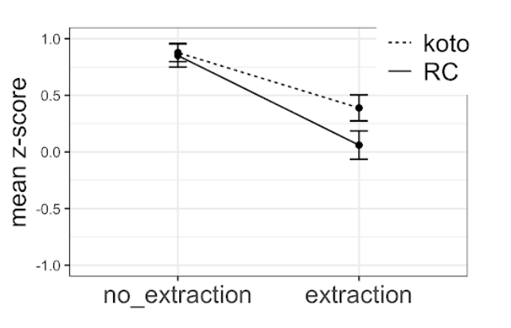
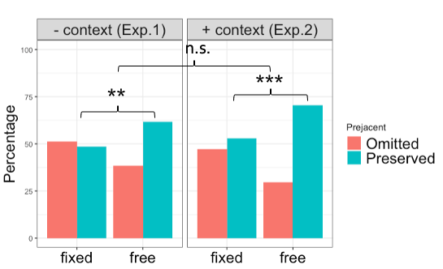

## Ongoing projects:

*	Island sensitivity of gap-filler dependencies as exemplified by double-gap relative clauses (RCs) in Japanese \
*\#experimental syntax*
    - I ran a couple of factorial-design acceptability experiments in order to examine whether the dependency where a gap precedes its filler would exhibit the same degree of island effects as filler-gap dependencies, focusing on the case in Japanese where relativization seems to have taken place out of another RC.
    - Presentation slides for a talk on this project can be accessed [here](CAMP_Takahashi.pdf) \
&nbsp;&nbsp;&nbsp;&nbsp;&nbsp;&nbsp;
*	Presuppositional component of 'only' and the effect of experimental manipulations on its interpretation
    - I conducted a series of experiments to find out what is presupposed by the focus marker 'only'; is it the prejacent of the sentence (e.g., "John ate only bananas" presupposes that "John ate (at least) bananas"), or something else? My focus is on whether a certain experimental paradigm, namely the one that proffers alternative propositions in the form of response options, can change the presuppositional component of 'only'.
    - Presentation slides for a talk on this project can be accessed [here](AMLaP_Takahashi.pdf) \
&nbsp;&nbsp;&nbsp;&nbsp;&nbsp;&nbsp;
*   Scalar implicature in online experiments
    - I am also conducting some experiments to discover the effects of modality, as well as the presence of an in-person experimenter, on the way participants engage in pragmatic reasoning, with a focus on the well-known "some-but-not-all" implicature.

## Past projects:
*	English-speaking children's acquisition of passive structures (write-up available [here](http://www.lingref.com/bucld/42/BUCLD42-16.pdf))
*	Japanese-speaking children's acquisition of the syntactic constraints on floating quantifiers (write-up available [here](https://scholarspace.manoa.hawaii.edu/bitstream/10125/58832/RN55-LLL2017.pdf))
*	Examination of verb restructuring in purpose clause and gerundive clause in Japanese (write-up available [here](http://www.waseda.jp/assoc-JATLaC/Journals/Resources/01.Takahashi.pdf))
