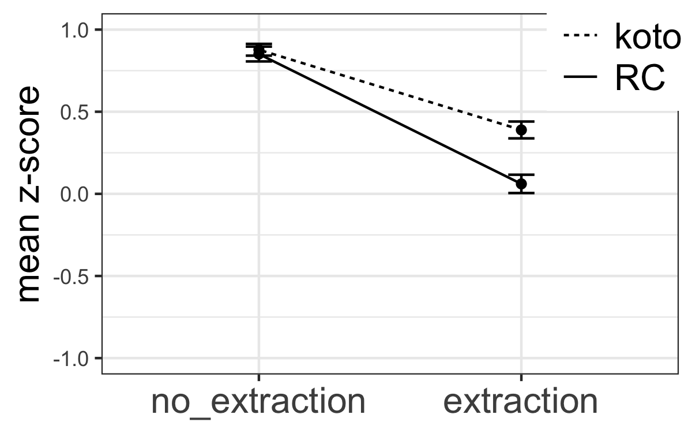
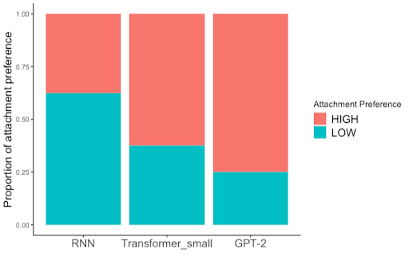

## Ongoing projects:

{::options parse_block_html="true" /}

#### Island sensitivity of Japanese double relatives
<!---*\#experimental syntax*&nbsp;*\#Japanese* \--->
&nbsp;&nbsp;

  
  * For my dissertation project, I have run a series of factorial-design acceptability experiments to examine (i) whether relativization out of a relative clause island (double relative) in Japanese exhibits an island effect, and (ii) which factors modulate the size of the relative clause island effect in English and Japanese.
  * Results presented in multiple conferences (CUNY 34, CAMP 4, CLS 58, HSP 36).

{::options parse_block_html="false" /}

---

{::options parse_block_html="true" /}

#### Presupposition of 'only'
<!---*\#semantics&pragmatics*&nbsp;*\#English* \--->
&nbsp;&nbsp;

  * I conducted multiple experiments to find out what is presupposed by English focus marker 'only'; is it the prejacent of the sentence (e.g., "John ate only bananas" presupposes that "John ate (at least) bananas"), or something else? My focus is on whether a certain experimental paradigm, namely the one that proffers alternative propositions in the form of response options, can change the presuppositional component of 'only'.
  * Presented at AMLaP 2021 ([slides](AMLaP_Takahashi.pdf))

{::options parse_block_html="false" /}

---

{::options parse_block_html="true" /}
#### Scalar implicature in online experiments
<!---*\#semantics&pragmatics*&nbsp;*\#English*--->
&nbsp;&nbsp;

  
  * I examined the effect of presentation modality (video/picture/text), as well as the presence of an in-person experimenter, on the way participants engage in pragmatic reasoning, with a focus on the well-known "some-but-not-all" implicature.
  * Presented at 2022 Experiments in Linguistic Meaning ([slides](ELM_Takahashi.pdf))

{::options parse_block_html="false" /}

---

{::options parse_block_html="true" /}
#### computational modelling of island constraints in Japanese
&nbsp;&nbsp;

  
  * I evaluated neural language models like LSTM and GPT-2 to find out if they are capable of capturing grammatical constraints like islands in Japanese. 
  * Findings presented at SCiL 6 ([link to proceedings](https://scholarworks.umass.edu/scil/vol6/iss1/33/))
  * [Link to code](https://github.com/matakahas/gap_filler_SCiL)

{::options parse_block_html="false" /}
 
## Past projects:
* Evaluating correlations between environmental and linguistic features (presented at 2022 JcoLE workshop "Machine Learning and the Evolution of Language"; [slides](JcoLE_Takahashi_Arnett.pdf))
*	English-speaking children's acquisition of passive structures (write-up available [here](http://www.lingref.com/bucld/42/BUCLD42-16.pdf))
*	Japanese-speaking children's acquisition of the syntactic constraints on floating quantifiers (write-up available [here](https://scholarspace.manoa.hawaii.edu/bitstream/10125/58832/RN55-LLL2017.pdf))
*	Examination of verb restructuring in purpose clause and gerundive clause in Japanese (write-up available [here](http://www.waseda.jp/assoc-JATLaC/Journals/Resources/01.Takahashi.pdf))
