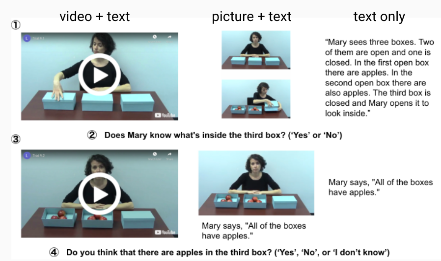

## Ongoing projects:

{::options parse_block_html="true" /}

#### Island sensitivity of relative clauses
<!---*\#experimental syntax*&nbsp;*\#Japanese* \--->
&nbsp;&nbsp;

  
  * For my dissertation project, I have run a series of factorial-design acceptability experiments to examine the island effect exihibited by relative clauses in Japanese and other languages, and investigated why the effect itself often has only a small impact on sentence acceptability. 
  * Results presented in the following conferences (with link to slides/posters): [CUNY 34](https://drive.google.com/file/d/1fXGpHyStAastPFcTgNHIoCEpTHCAupjb/view?usp=sharing), [CAMP 4](https://drive.google.com/file/d/1mOUCpi8wBIFOI0knB4TIS_XFMt77k1de/view?usp=sharing), [CLS 58](https://drive.google.com/file/d/1W18X_c2dhdiMcoLw5T18sTV0ew_-C3Mi/view?usp=sharing), HSP 36([1](https://drive.google.com/file/d/1RCVXc6pRRYrUNZzbZhOAXcz2WuuTxIiz/view?usp=sharing)/[2](https://drive.google.com/file/d/1xqxrvH8ItgJOpcHocMpxFvWB6PA6V_NH/view?usp=sharing))).

{::options parse_block_html="false" /}

---

{::options parse_block_html="true" /}

#### Presupposition of 'only'
<!---*\#semantics&pragmatics*&nbsp;*\#English* \--->
&nbsp;&nbsp;

  * I conducted multiple experiments to find out what is presupposed by English focus marker 'only'; is it the prejacent of the sentence (e.g., "John ate only bananas" presupposes that "John ate (at least) bananas"), or something else? My focus is on whether a certain experimental paradigm, namely the one that proffers alternative propositions in the form of response options, can change the presuppositional component of 'only'.
  * Presented at [AMLaP 2021](AMLaP_Takahashi.pdf)

{::options parse_block_html="false" /}

---

{::options parse_block_html="true" /}
#### Scalar implicature in online experiments
<!---*\#semantics&pragmatics*&nbsp;*\#English*--->
&nbsp;&nbsp;

  
  * I examined the effect of presentation modality (video/picture/text), as well as the presence of an in-person experimenter, on the way participants engage in pragmatic reasoning, with a focus on the well-known "some-but-not-all" implicature.
  * Presented at 2022 [ELM](ELM_Takahashi.pdf) (Experiments in Linguistic Meaning) 

{::options parse_block_html="false" /}

---

{::options parse_block_html="true" /}
#### computational modelling of island constraints in Japanese
&nbsp;&nbsp;

  
  * I evaluated neural language models like LSTM and GPT-2 to find out if they are capable of capturing grammatical constraints such as islands in Japanese. 
  * Findings presented at [SCiL 6](https://drive.google.com/file/d/1nJSByLHvVmY435BdvCpkLJfRIcR5pbki/view?usp=sharing) 
  * [Link to code](https://github.com/matakahas/gap_filler_SCiL)

{::options parse_block_html="false" /}
 
## Past projects:
* Computational modelling of relative clause attachment preference in Japanese (write-up available [here](https://drive.google.com/file/d/1ooY4d3Tr325b9aV6TUTiuQI-5rvfvuL6/view?usp=sharing))
* Evaluating correlations between environmental and linguistic features (presented at 2022 JcoLE workshop "Machine Learning and the Evolution of Language"; [slides](JcoLE_Takahashi_Arnett.pdf))
*	English-speaking children's acquisition of passive structures (write-up available [here](http://www.lingref.com/bucld/42/BUCLD42-16.pdf))
*	Japanese-speaking children's acquisition of the syntactic constraints on floating quantifiers (write-up available [here](https://scholarspace.manoa.hawaii.edu/bitstream/10125/58832/RN55-LLL2017.pdf))
*	Examination of verb restructuring in purpose clause and gerundive clause in Japanese (write-up available [here](http://www.waseda.jp/assoc-JATLaC/Journals/Resources/01.Takahashi.pdf))
